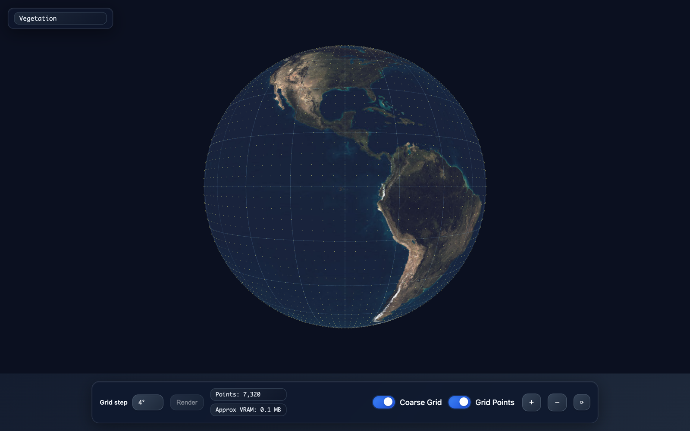

<div align="center">

# 🌍 WorldViewer

### An interactive 3D climate-data globe rendered in the browser with Three.js and WebGL — spin the Earth, swap between vegetation, temperature, pollution and precipitation layers, and overlay a lat/lon point grid down to 0.125° resolution.

[](https://dishasawantt.github.io/WorldViewer/)
[](https://threejs.org/)
[](https://get.webgl.org/)
[](https://developer.mozilla.org/en-US/docs/Web/JavaScript)
[](https://developer.mozilla.org/en-US/docs/Web/HTML)

**[Overview](#-overview) · [Features](#-features) · [How it works](#-how-it-works) · [Tech Stack](#-tech-stack) · [Run Locally](#-run-locally)**

</div>

<p align="center"><a href="https://dishasawantt.github.io/WorldViewer/"></a></p>

---

## 🧭 Overview

WorldViewer is a zero-build, single-page WebGL application that renders a rotatable 3D Earth and drapes global climate imagery across it. Each texture is an equirectangular map of a different variable — vegetation, temperature, pollution, or precipitation — that you can switch between live. On top of the sphere it generates a configurable latitude/longitude point grid, letting you visualize sampling density from a coarse 4° lattice all the way down to a dense 0.125° grid.

> **Try it live:** [https://dishasawantt.github.io/WorldViewer/](https://dishasawantt.github.io/WorldViewer/)

## ✨ Features

- **Interactive 3D globe** — orbit, zoom, and reset the camera with damped `OrbitControls`; the Earth is a high-resolution `SphereGeometry` lit by uniform ambient light for flat, map-accurate reading of every layer.
- **Swappable climate layers** — pick from seven textures (Vegetation, Temperature, Pollution, Precipitation, plus Discrete/Mask variants); textures are hot-swapped on the material and the previous one is disposed to free GPU memory.
- **Configurable lat/lon point grid** — choose a grid step from 4° down to 0.125° and regenerate the point cloud on demand with the **Render** button.
- **Live performance metrics** — the toolbar reports the exact point count and an approximate VRAM footprint for the current grid.
- **Automatic point budgeting** — a 1.2M-point cap decimates ultra-dense grids by an even skip factor so the browser stays responsive at fine resolutions.
- **Toggle overlays** — independently show or hide the coarse graticule lines and the generated grid points.
- **Responsive & self-contained** — a fixed grid layout adapts to small screens, and Three.js loads via an ES-module import map with no bundler or build step.

## 🔧 How it works

The app builds a single Three.js scene and drives it from the bottom toolbar. Layer imagery is applied as a `MeshBasicMaterial` map, while the graticule and the grid are separate objects generated procedurally from latitude/longitude math.

```mermaid
flowchart TD
    A[User picks texture] --> B[TextureLoader loads assets/*.png|jpg]
    B --> C[MeshBasicMaterial.map updated<br/>old texture disposed]
    C --> D[Globe: SphereGeometry 128×128]

    E[User picks grid step 4° → 0.125°] --> F[estimateCounts:<br/>lat × lon totals]
    F --> G{total > 1.2M points?}
    G -- yes --> H[compute even skip factor]
    G -- no --> I[skip = 1]
    H --> J[generateGrid: fill Float32Array<br/>of lat/lon → XYZ positions]
    I --> J
    J --> K[THREE.Points cloud + metrics<br/>point count · approx VRAM]

    D --> L[Scene]
    K --> L
    M[Graticule lines] --> L
    L --> N[OrbitControls + WebGLRenderer<br/>animate loop]
```

Each surface point is placed by converting `(lat, lon)` to Cartesian coordinates on a unit sphere with a small radial offset so the points sit just above the texture rather than z-fighting with it.

## 🛠 Tech Stack

| Layer | Technology |
| --- | --- |
| 3D / rendering | [Three.js](https://threejs.org/) `0.160.0` (WebGL) |
| Camera controls | `OrbitControls` (Three.js addons) |
| Language | JavaScript (ES modules) |
| Markup & styling | HTML5, CSS3 (custom-property theme, backdrop-filter UI) |
| Module loading | Native import map via jsDelivr CDN — no bundler |
| Hosting | GitHub Pages |

## 🚀 Run Locally

Because the app uses native ES modules and an import map, it must be served over HTTP (opening `index.html` directly via `file://` will not work). Any static file server does the job.

```bash
# Clone the repository
git clone https://github.com/dishasawantt/WorldViewer.git
cd WorldViewer

# Serve the static files (Python 3)
python3 -m http.server 8000

# Then open http://localhost:8000 in your browser
```

Prefer Node? Any static server works just as well:

```bash
npx serve .
```

There is no build step and no dependencies to install — Three.js is pulled from a CDN at runtime.

## 🎛 Controls

| Control | What it does |
| --- | --- |
| **Texture selector** (top-left) | Switch the climate layer draped over the globe |
| **Grid step** | Set the lat/lon spacing of the point grid (4° → 0.125°) |
| **Render** | Regenerate the point grid at the selected step |
| **Coarse Grid** | Toggle the graticule reference lines |
| **Grid Points** | Toggle the generated point cloud |
| **＋ / － / ⟳** | Zoom in, zoom out, reset the camera |
| **Drag** | Orbit the globe |

---

<div align="center">

### Disha Sawant
**AI Application Engineer** · M.S. Computer Engineering @ SDSU

[](https://dishasawantt.github.io/resume)
[](https://linkedin.com/in/disha-sawant-7877b21b6)
[](https://github.com/dishasawantt)
[](mailto:dishasawantt@gmail.com)

</div>
